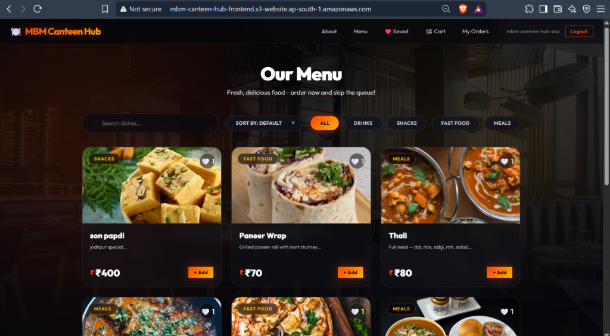
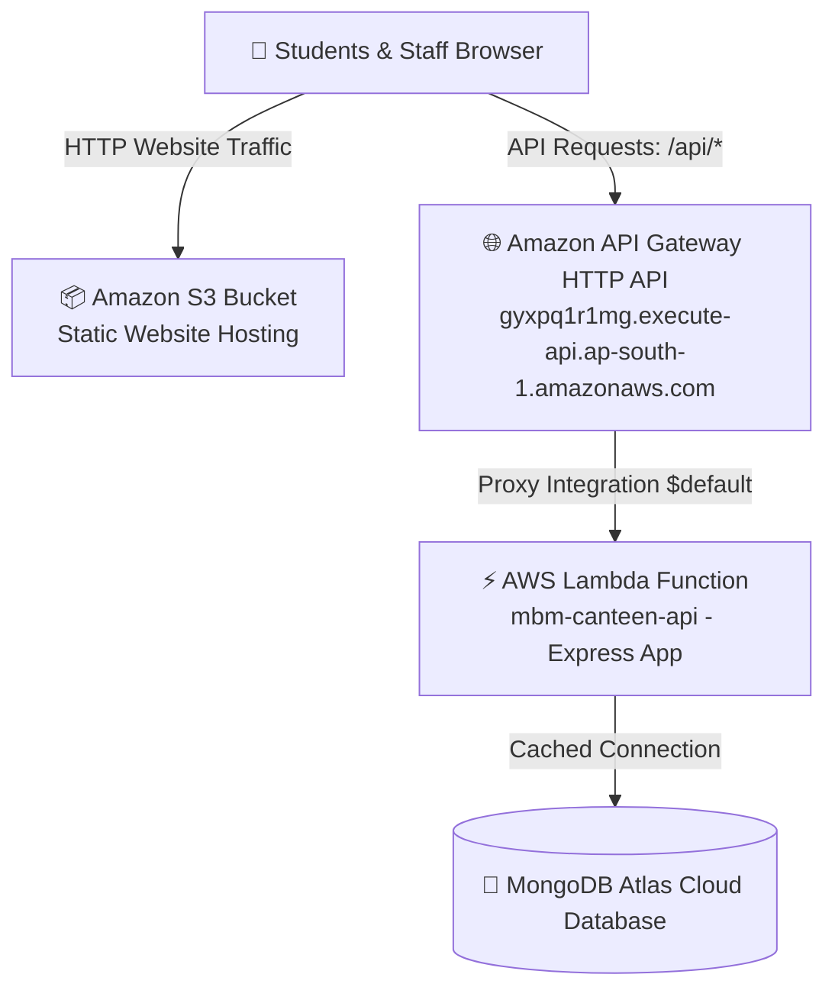

# 🍽️ MBM Canteen Hub — AWS Serverless Architecture

<div align="center">
  
  [](https://aws.amazon.com/lambda/)
  [](https://aws.amazon.com/api-gateway/)
  [](https://aws.amazon.com/s3/)
  [](https://react.dev/)
  [](https://nodejs.org/)
  [](https://www.mongodb.com/)

  <p align="center">
    A scalable, cost-efficient college canteen ordering system built with a modern <b>AWS Serverless architecture</b>. 
    Powered by <b>AWS Lambda</b>, <b>Amazon API Gateway</b>, <b>Amazon S3 Static Website Hosting</b>, and <b>MongoDB Atlas</b>, 
    delivering zero idle costs, automatic scaling, and minimal maintenance overhead.
  </p>

  <h3>
    🚀 <a href="http://mbm-canteen-hub-frontend.s3-website.ap-south-1.amazonaws.com" target="_blank"><b>Live Application Demo (S3 Website)</b></a>
  </h3>

  <h4>
    <a href="#-live-application">Live Preview</a> | 
    <a href="#-architecture-diagram">Architecture</a> | 
    <a href="#%EF%B8%8F-installation--local-development">Local Setup</a> | 
    <a href="DEPLOYMENT.md">Production Deployment Guide</a>
  </h4>

</div>

---

## 📸 Live Application



### 🔗 Live Deployment Endpoints

| Resource | Service | Endpoint |
|---|---|---|
| **Frontend Website** | Amazon S3 (Static Website Hosting) | [http://mbm-canteen-hub-frontend.s3-website.ap-south-1.amazonaws.com](http://mbm-canteen-hub-frontend.s3-website.ap-south-1.amazonaws.com) |
| **Backend API Gateway** | Amazon API Gateway (HTTP API) | `https://gyxpq1r1mg.execute-api.ap-south-1.amazonaws.com` |
| **API Health Check** | AWS Lambda via API Gateway | [https://gyxpq1r1mg.execute-api.ap-south-1.amazonaws.com/api/health](https://gyxpq1r1mg.execute-api.ap-south-1.amazonaws.com/api/health) |
| **Menu Endpoint** | Express Router via Lambda | [https://gyxpq1r1mg.execute-api.ap-south-1.amazonaws.com/api/menu](https://gyxpq1r1mg.execute-api.ap-south-1.amazonaws.com/api/menu) |
| **AWS Region** | ap-south-1 (Mumbai) | `ap-south-1` |

---

## 📖 Project Overview

**MBM Canteen Hub** is a full-stack MERN ordering application designed to streamline canteen operations for students and administrative staff. 

The application provides:
- Seamless online menu browsing and cart management
- Student order placement with status tracking (Pending → Preparing → Ready → Delivered)
- Secure JWT-based authentication with role-based access (Student / Admin)
- Admin dashboard with order management, dish availability toggles, and canteen analytics
- Fully serverless deployment on AWS with pay-per-use economics and zero server management

---

## 🛠️ Tech Stack & Architecture

### Application Stack
- **Frontend:** React 19, Vite (Single Page Application architecture)
- **Backend:** Node.js, Express.js 5 with `serverless-http` wrapper
- **Database:** MongoDB Atlas (Cloud-managed Document database with cached Mongoose connections)

### AWS Serverless Cloud Stack
- **Compute:** AWS Lambda (`mbm-canteen-api`, Node.js runtime, stateless execution)
- **API Routing:** Amazon API Gateway (`mbm-canteen-api-gateway`, HTTP API with CORS and proxy integration)
- **Frontend Hosting:** Amazon S3 (`mbm-canteen-hub-frontend`, Static Website Hosting)

---

## 🗺️ Architecture Diagram



---

## 📂 Folder Structure

```
mbm-canteen-hub/
├── backend/
│   ├── src/                    # Backend source controllers, models, routes & middleware
│   │   ├── config/             # MongoDB connection config with Lambda reuse
│   │   ├── controllers/        # Auth, dishes, orders, and admin controllers
│   │   ├── middleware/         # Auth, admin, and validation middleware
│   │   └── models/             # Mongoose schemas (User, Dish, Order)
│   ├── scripts/                # Database utilities (cleanIndices, seedAdmin)
│   ├── .env.example            # Backend environment variables template
│   ├── lambda.js               # AWS Lambda entry point (serverless-http handler)
│   ├── package.json            # Node.js dependencies (Express, serverless-http)
│   ├── seed.js                 # Initial menu database seeder
│   └── server.js               # Express application setup & local dev runner
├── frontend/
│   ├── src/                    # React SPA source components & pages
│   │   ├── components/         # Navbar, DishCard, OrderCard, CartDrawer, etc.
│   │   ├── context/            # AuthContext, CartContext, FeedbackContext
│   │   ├── pages/              # Menu, Cart, Orders, AdminDashboard, ManageOrders
│   │   └── services/           # Axios API client
│   ├── .env.example            # Frontend environment variables template
│   ├── index.html              # HTML entry point
│   ├── package.json            # Frontend dependencies (React, Vite, Axios)
│   └── vite.config.js          # Vite build & dev proxy configuration
├── .gitignore                  # Git exclusions (.env, node_modules, dist, *.zip)
├── DEPLOYMENT.md               # Step-by-step AWS Serverless deployment guide
└── README.md                   # Project documentation
```

---

## 🔑 Environment Variables

### Backend (`backend/.env`)
- `PORT` - Port the Express server listens on during local dev (Default: `5000`)
- `NODE_ENV` - Runtime mode (`development` | `production`)
- `MONGO_URI` - MongoDB Atlas connection string (`mongodb+srv://...`)
- `JWT_SECRET` - Secret key used to sign and verify JWT tokens
- `FRONTEND_URL` - S3 static website endpoint or local origin allowed by CORS (e.g. `http://localhost:5173`)

### Frontend (`frontend/.env`)
- `VITE_API_URL` - Endpoint address pointing to the backend API Gateway or local server (e.g. `http://localhost:5000/api`)

---

## 🛠️ Installation & Local Development

### 1. Prerequisites
- [Node.js](https://nodejs.org/) (v20+ recommended)
- MongoDB Atlas cluster connection URI

### 2. Setup & Run Locally

```bash
# Clone the repository
git clone https://github.com/bhavesh7742/mbm-canteen-hub.git
cd mbm-canteen-hub

# Setup backend environment
cp backend/.env.example backend/.env
# Edit backend/.env with your MONGO_URI and JWT_SECRET

# Setup frontend environment
cp frontend/.env.example frontend/.env
# VITE_API_URL=http://localhost:5000/api

# Install dependencies
npm run install:all

# Run backend (Terminal 1)
cd backend
npm run dev

# Run frontend (Terminal 2)
cd frontend
npm run dev
```

Open `http://localhost:5173` in your browser.

---

## ⚙️ Production Deployment

For the complete AWS Serverless step-by-step deployment guide using the AWS Management Console or AWS CLI, see [DEPLOYMENT.md](DEPLOYMENT.md).

Overview of the deployment:
1. **MongoDB Atlas:** Configure Network Access to allow all IPs (`0.0.0.0/0`) for Lambda elasticity.
2. **AWS Lambda:** Package and deploy `backend/` with `lambda.js` as the handler (`lambda.handler`).
3. **Amazon API Gateway:** Create an HTTP API with a `$default` or `/{proxy+}` route targeting the Lambda function.
4. **Amazon S3:** Build the React frontend (`npm run build`) and upload `frontend/dist/` to an S3 bucket configured for static website hosting with `index.html` as the index and error document.

---

## 📄 License
ISC