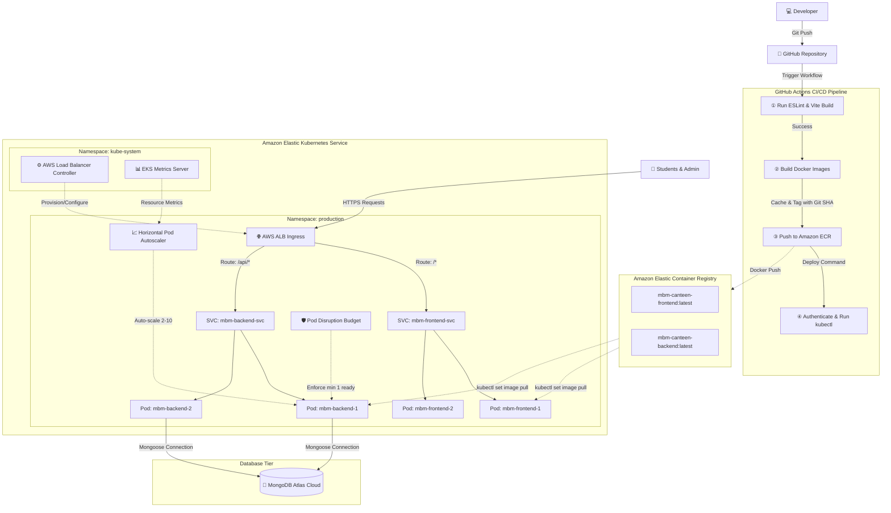

# 🍽️ MBM Canteen Hub — Production Cloud & Kubernetes Architecture

<div align="center">
  
  [](https://github.com/features/actions)
  [](https://www.docker.com/)
  [](https://kubernetes.io/)
  [](https://aws.amazon.com/)

  [](https://react.dev/)
  [](https://nodejs.org/)
  [](https://www.mongodb.com/)
  [](LICENSE)

  <p align="center">
    A production-grade, highly-available college canteen ordering system built with a cloud-native architecture. 
    Deployed on <b>Amazon EKS (Elastic Kubernetes Service)</b> using a fully automated <b>GitHub Actions CI/CD Pipeline</b>, 
    featuring self-healing container probes, zero-downtime rolling updates, and horizontal auto-scaling.
  </p>

  <h4>
    <a href="#-architecture-diagram">View Architecture</a> | 
    <a href="#-devops--cloud-achievements">Resume Bullet Points</a> | 
    <a href="#%EF%B8%8F-installation--local-development">Local Setup</a> | 
    <a href="#%EF%B8%8F-production-aws--kubernetes-deployment">Production Setup</a>
  </h4>

</div>

---

## 📖 Project Overview

**MBM Canteen Hub** is a full-stack MERN ordering application designed to streamline canteen operations for students and administrative staff. 

While the application features premium client ordering flows, real-time status updates via WebSockets, and administrative controls, the **primary value of this project lies in its enterprise-style DevOps pipeline**. 

This system represents a fully production-ready transition from local development to scale, leveraging containerization, continuous integration, continuous delivery, and dynamic infrastructure management on AWS.

---

## ✨ Features

- **⚡ Real-Time Synchronization:** Socket.io event-driven order processing notifies the admin dashboard instantly on new orders and updates students when food is ready.
- **🛡️ Secure Token Sessions:** Session authorization using JSON Web Tokens (JWT) stored client-side and validated via Express backend middleware.
- **🚦 Security Protection:** Rate-limiting middleware protects routes against brute-force attacks and DDoS, while Helmet sets HTTP protection headers.
- **🔄 Auto-Scaling & Availability:** Dynamic pod horizontal scaling (2 to 10 instances) based on CPU/memory load and a budget policy to maintain active pods during updates.
- **🌍 Dynamic Load Balancing:** Unified Application Load Balancer routing traffic to frontend and backend pods under a single ingress rule.

---

## 🛠️ Tech Stack & DevOps Stack

### Application Stack
- **Frontend:** React, Vite (Single Page Application architecture)
- **Backend:** Node.js, Express.js (REST API, WebSockets)
- **Database:** MongoDB Atlas (Cloud-managed Document database)
- **Real-Time Communication:** Socket.io

### DevOps & Cloud Infrastructure Stack
- **Containerization:** Docker (Multi-stage production builds)
- **Local Orchestration:** Docker Compose (Service isolation)
- **CI/CD Pipeline:** GitHub Actions (Automated building, linting, testing, and deployment)
- **Container Registry:** Amazon Elastic Container Registry (ECR)
- **Cluster Orchestration:** Amazon Elastic Kubernetes Service (EKS)
- **Ingress Controller:** AWS Application Load Balancer (ALB) Controller
- **Kubernetes Resources:** Deployments, Services, ConfigMaps, Secrets, Horizontal Pod Autoscaler (HPA), PodDisruptionBudget (PDB)
- **Metrics Aggregation:** EKS Metrics Server (Exposes pod resource utilization)

---

## 🗺️ Architecture Diagram

The entire continuous deployment and runtime flow is detailed below:



---

## 📂 Folder Structure

```
mbm-canteen-hub/
├── .github/
│   └── workflows/
│       └── deploy.yml          # GitHub Actions 3-Job Pipeline
├── backend/
│   ├── src/                    # Backend source controllers & models
│   ├── .dockerignore           # Excludes node_modules/ & local files from build
│   ├── .env.example            # Environment variables template
│   ├── Dockerfile              # Production-grade Node.js image builder
│   └── server.js               # Express server entry point
├── frontend/
│   ├── src/                    # React SPA source components & pages
│   ├── .env.example            # Environment variables template
│   ├── Dockerfile              # Nginx alpine runner serving production build
│   └── nginx.conf              # SPA-compliant Nginx routing configuration
├── k8s/
│   ├── alb-controller.yaml     # Production ALB controller manifests
│   ├── alb-service-account.yaml# OIDC role-mapping for AWS ALB
│   └── production/
│       ├── namespace.yaml      # Production namespace configuration
│       ├── configmap.yaml      # Non-sensitive configs (frontend URL)
│       ├── secret.yaml         # Sensitive credentials (Mongo URI)
│       ├── backend-deployment.yaml  # Replicas, probes, limits, rolling configs
│       ├── backend-service.yaml     # Internal cluster IP mapping
│       ├── backend-hpa.yaml         # Scaling configuration (2 to 10 pods)
│       ├── frontend-deployment.yaml # Static server replicas
│       ├── frontend-service.yaml    # Frontend internal mapping
│       ├── ingress.yaml             # ALB routing mappings (sticky WS)
│       └── pdb.yaml                 # High-availability disruption checks
└── docker-compose.yml          # Local orchestration workflow
```

---

## ☁️ AWS Infrastructure Setup

1. **Amazon EKS (Elastic Kubernetes Service):** Deployed a Kubernetes control plane (v1.31) with a managed node group consisting of 2× `t3.small` EC2 worker nodes distributed across different Availability Zones (ap-south-1a and ap-south-1b).
2. **AWS Application Load Balancer (ALB):** Provisioned automatically by the `aws-load-balancer-controller` running in EKS. It maps incoming public HTTP traffic on port 80 to respective services inside EKS.
3. **AWS IAM OIDC Provider:** Configured OpenID Connect (OIDC) identity mapping to bind Kubernetes ServiceAccounts to IAM Roles, granting the ALB Controller least-privilege permissions to create and destroy ALB resources without hardcoded access keys.
4. **Amazon ECR:** Hosted secure private container registries for both frontend and backend built images.

---

## ☸️ Kubernetes Resources Configuration

- **Deployments:** Configured rolling updates with `maxSurge: 1` and `maxUnavailable: 0` to achieve zero-downtime releases. Liveness and Readiness probes verify the Express server `/api/health` before routing traffic.
- **Services:** Defined internal `ClusterIP` services to allow microservice networking while hiding components behind the Ingress.
- **Ingress:** Leverages AWS ALB to manage routing paths `/api/*` to backend and `/*` to frontend with sticky sessions configured to support WebSockets.
- **Horizontal Pod Autoscaler (HPA):** Monitors CPU (70% target) and memory (80% target) usage. If limits are reached, EKS automatically scales backend pods from 2 up to 10 instances.
- **PodDisruptionBudget (PDB):** Enforces that at least 1 backend pod remains healthy and responsive during nodes eviction, maintenance, or rolling deployments.

---

## 🔄 CI/CD Workflow (GitHub Actions)

A push of code triggers a fully automated 3-stage deployment pipeline:

1. **Lint & Build Stage:** Compiles the React Vite client and runs ESLint over the JavaScript source files. If any syntax error or lint warning is found, the pipeline halts immediately.
2. **ECR Publish Stage:** Automatically authenticates with AWS, builds the respective backend and frontend Docker containers, and pushes the compiled images tagged with the unique Git Commit SHA to Amazon ECR.
3. **EKS Deploy Stage:** Interacts with the Kubernetes API, updates the Deployment manifests with the new image tags, and checks rollout status. If the new container crashes on startup (e.g. database disconnect), Kubernetes aborts and retains the previous version.

---

## 🔑 Environment Variables

### Backend (`backend/.env.example`)
- `PORT` - Port the Express server listens on (Default: `5000`)
- `NODE_ENV` - Runtime mode (`development` | `production`)
- `MONGO_URI` - MongoDB Atlas connection string
- `JWT_SECRET` - Key used to encrypt tokens
- `FRONTEND_URL` - Main client origin allowed by CORS

### Frontend (`frontend/.env.example`)
- `VITE_API_URL` - Public endpoint address pointing to the backend API

---

## 🛠️ Installation & Local Development

### 1. Pre-requisites
- [Docker & Docker Desktop](https://www.docker.com/) installed
- [Node.js](https://nodejs.org/) (v22+) installed

### 2. Run Local Multi-Container System
```bash
# Clone the repository
git clone https://github.com/YOUR_USERNAME/mbm-canteen-hub.git
cd mbm-canteen-hub

# Create environment variable configurations
cp backend/.env.example backend/.env
cp frontend/.env.example frontend/.env

# Update MONGO_URI and JWT_SECRET inside backend/.env with your values

# Spin up backend and frontend containers
docker-compose up -d --build

# Verify that backend health check is working
curl http://localhost:5000/api/health
```
- Open `http://localhost` in your browser to interact with the React Web Application.

---

## ⚙️ Production AWS & Kubernetes Deployment

To deploy this configuration manually using EKS and AWS CLI:

### 1. AWS Configuration
```bash
# Authenticate AWS CLI
aws configure

# Verify credentials identity
aws sts get-caller-identity
```

### 2. Create ECR Repositories
```bash
# Create Backend Registry
aws ecr create-repository --repository-name mbm-canteen-backend --region ap-south-1

# Create Frontend Registry
aws ecr create-repository --repository-name mbm-canteen-frontend --region ap-south-1
```

### 3. Connect kubectl to EKS Cluster
```bash
# Update local kubeconfig context
aws eks update-kubeconfig --name mbm-canteen --region ap-south-1

# Check cluster nodes
kubectl get nodes
```

### 4. Deploy Metrics Server for HPA
```bash
kubectl apply -f https://github.com/kubernetes-sigs/metrics-server/releases/latest/download/components.yaml
```

### 5. Create Secrets & Apply ConfigMaps
Create `k8s/production/secret.yaml` by base64-encoding your MongoDB URI and secret tokens:
```bash
# Base64 encode example
echo -n "mongodb+srv://..." | base64
```
Apply the configuration files to EKS:
```bash
kubectl apply -f k8s/production/namespace.yaml
kubectl apply -f k8s/production/configmap.yaml
kubectl apply -f k8s/production/secret.yaml
```

### 6. Apply Deployments, Services, and Ingress
```bash
# Apply Deployments and Services
kubectl apply -f k8s/production/backend-deployment.yaml
kubectl apply -f k8s/production/backend-service.yaml
kubectl apply -f k8s/production/frontend-deployment.yaml
kubectl apply -f k8s/production/frontend-service.yaml

# Apply scaling policies & budgets
kubectl apply -f k8s/production/backend-hpa.yaml
kubectl apply -f k8s/production/pdb.yaml

# Apply Ingress controller
kubectl apply -f k8s/production/ingressclass.yaml
kubectl apply -f k8s/production/ingress.yaml
```

### 7. Find Public URL
```bash
kubectl get ingress -n production
```
Copy the `ADDRESS` host value from the output (e.g. `k8s-producti-...elb.amazonaws.com`) and paste it in your browser.

---

## 📸 Screenshots

### Local Development Orchestration
*📂 Section Placeholder*
`[ screenshots/home.png ]` - Front page client dashboard
`[ screenshots/menu.png ]` - Category filters and sorting system

### Kubernetes Control Panel & Resource Metrics
*📂 Section Placeholder*
`[ screenshots/admin.png ]` - Active orders dashboard

### GitHub Actions Successful Deploy Pipeline
*📂 Section Placeholder*
`[ screenshots/github-actions.png ]` - Green automated deployment pipeline workflow
`[ screenshots/architecture.png ]` - Mermaid diagram preview

---

## 🚀 Live Demo & Repository Link

- **GitHub Code Repository:** [https://github.com/YOUR_USERNAME/mbm-canteen-hub](https://github.com/YOUR_USERNAME/mbm-canteen-hub)
- **Live Deployment URL:** [http://k8s-producti-mbmingre-553e480964-1759019714.ap-south-1.elb.amazonaws.com](http://k8s-producti-mbmingre-553e480964-1759019714.ap-south-1.elb.amazonaws.com)
- **API Health Check:** [http://k8s-producti-mbmingre-553e480964-1759019714.ap-south-1.elb.amazonaws.com/api/health](http://k8s-producti-mbmingre-553e480964-1759019714.ap-south-1.elb.amazonaws.com/api/health)

---


